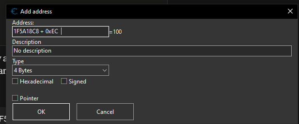
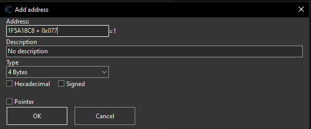
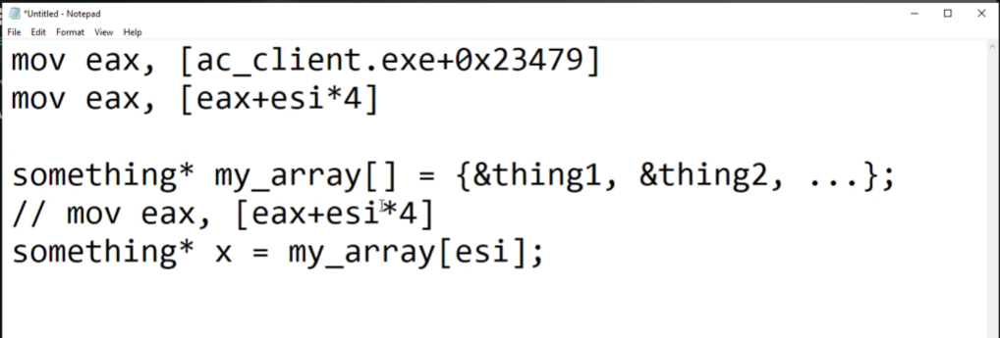
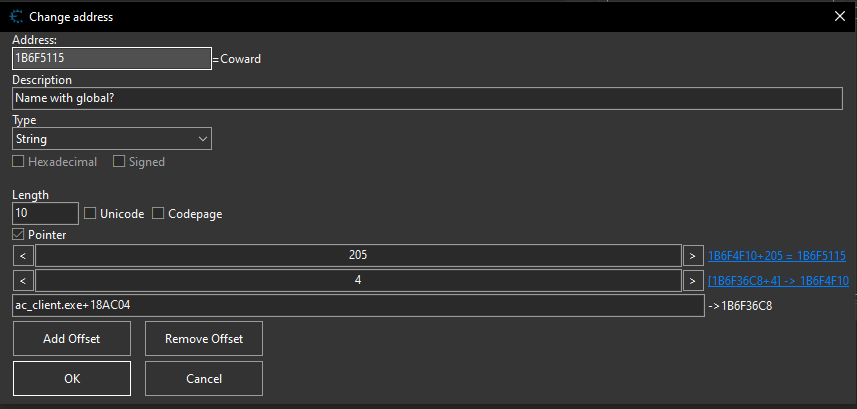
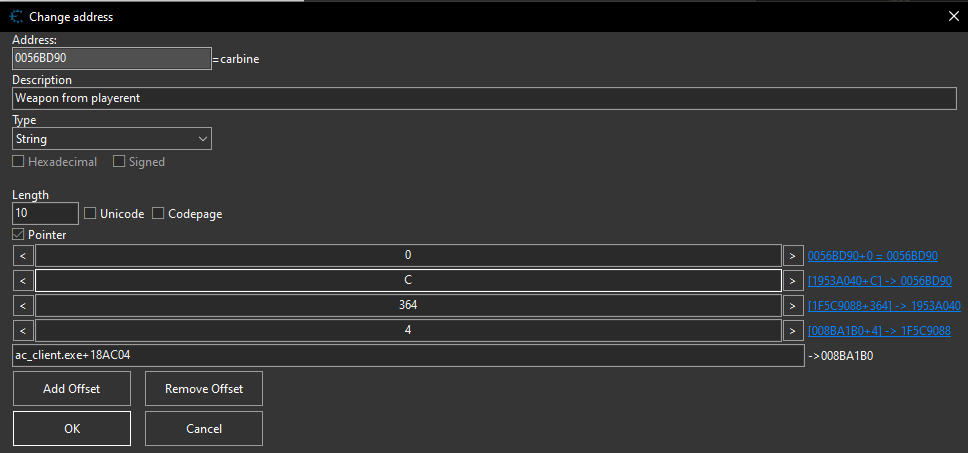
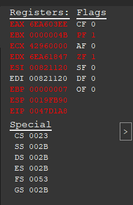
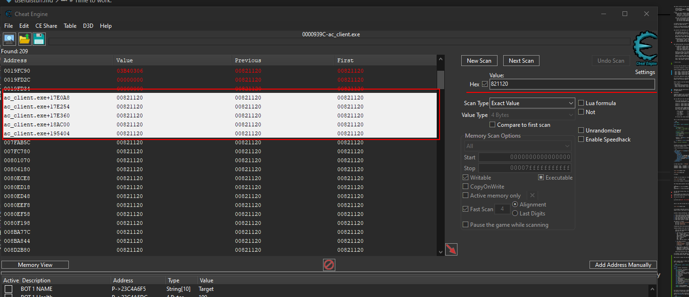

https://github.com/assaultcube/AC/blob/master/source/src/entity.h#L59
https://github.com/assaultcube/AC/blob/13f0d8eea4822dee5c976661218d022be74342e3/source/src/server.h#L171
https://gamehacking.academy/pages/1/02/#memory
https://github.com/assaultcube/AC/blob/13f0d8eea4822dee5c976661218d022be74342e3/source/src/entity.h
https://www.youtube.com/watch?v=TCu0qSivXUc

# FOR REFERENCE

the full workflow from zero

1. scan for a known value (health = 100)
2. damage/heal to narrow down to one address → confirmed field address
3. subtract field offset from address → object base (changes every session)
4. verify base by checking other known offsets
5. scan for base address as 4 bytes hex
6. look for ac_client.exe+ result → static pointer (never changes)
7. OR trace backwards through assembly from field access to find static pointer
8. save as pointer chain in cheat table:
      ac_client.exe+XXXXXX → pointer → +offset → field value
9. verify survives game restart → done

for other players/bots:
   same process but the static pointer leads to an array
   array[0] = null, array[1] = first entity base, array[2] = second, etc.
   count stored separately at another static address

```cpp
C++ type        bytes    CE type       notes
─────────────────────────────────────────────────────
bool            1        Byte          0=false 1=true
char            1        Byte          signed -128 to 127
uchar           1        Byte          unsigned 0 to 255
short           2        2 Bytes
int             4        4 Bytes
float           4        Float         positions, angles
double          8        Double
pointer*        4        Pointer       32-bit process
enet_uint32     4        4 Bytes       same as unsigned int
vec             12       3× Float      x y z components
vec[N]          12×N     N× Float
int[N]          4×N      N× 4 Bytes
bool[N]         1×N      N× Byte       pack together no padding
animstate       20       (unknown internals)
string/char[]   1×N      String        name = 16 bytes
─────────────────────────────────────────────────────
padding rule:
  after bools before int/float → pad to next multiple of 4
  103 % 4 = 3 → 1 byte padding
  257 % 4 = 1 → 3 bytes padding
  533 % 4 = 1 → 3 bytes padding
─────────────────────────────────────────────────────
vtable ptr rule:
  any class with virtual keyword → 4 bytes at offset 0
  one ptr per class regardless of how many virtual functions
─────────────────────────────────────────────────────
inheritance rule:
  inherited block ALWAYS comes before own fields
  left-to-right order for multiple inheritance
  playerent : public dynent, public playerstate
  → dynent (includes physent) first
  → playerstate second
  → playerent own fields last
```


terminology: three things people call "base" that are NOT the same

   field address (or raw address)
      the actual memory address where a specific value lives right now
      example: 27136B7C  ← where health bytes are stored this session
      changes every session, useless to save on its own

   object base (or entity base, or instance base)
      the start of the playerent/botent object in heap memory
      offset 0 of the entire inheritance block = start of physent vtable ptr
      example: 27136A90  ← this session's player object start
      changes every session, but all offsets are measured from here
      how you get it: field address - field offset (27136B7C - 0xEC = 27136A90)

   static pointer (or base pointer, or global pointer)
      the address inside ac_client.exe that HOLDS the object base
      lives in the executable's data section, never changes between sessions
      example: ac_client.exe+17BA60  ← always contains current object base
      how you get it: scan for object base as 4 bytes hex, find the ac_client.exe+ result

the chain written out with correct terminology:

   static pointer          object base        field address    value
   ac_client.exe+17BA60 → 27136A90        →  27136B7C      →  100
   (never changes)         (heap, changes)    (heap, changes)  (health)

in CE:
   when you add an address manually with pointer ticked:
      address box = static pointer    ← ac_client.exe+17BA60
      offset box  = field offset      ← EC
      CE reads: static pointer → object base → object base + EC → value

   when CE's struct dissect shows offsets:
      those are distances from the object base
      not from the static pointer
      not from the field address


to usually find our own player object what we can / need to do would be to have our health and damage ourselves and then do decrease by and see what keeps changing, and then we have the health and etc. 

interms of finding ourselves and the entire struct, remember that the tool for creating data structuers cheat engine guesses it so it could or could not be accurate, this is  a psosibility, some attributes just get missed completely or they assume theyre 4 bytes instead of 1 and etc. etc.


why pointers and addresses are always hex

   every address you see in CE, disassemblers, memory view → hex.
   hex digits are 0-9 and A-F. if you see letters in an address that's why.
   0x prefix just makes it explicit. 0x1F5A19B4 and 1F5A19B4 are the same thing.

   when doing math on addresses always use Calculator in Programmer mode with HEX selected.
   decimal will reject the letters and give you garbage.

   subtracting an offset from an address:
      health_address - 0xEC = object base
      you're asking "health is 236 bytes forward from the start, so where is the start?"
      going backwards by the offset lands you at offset 0 = the object base.


why subtracting 0xEC from health gives you the object base and not something weird

   the inheritance chain stacks in memory like this:
      offset 0:   physent block     ← object base (this is what you want)
      offset 128: dynent block
      offset 232: playerstate block ← health lives in here at +4 from playerstate start
      offset 440: playerent own fields

   physent is always first because it's the root parent. every class that inherits
   from physent starts with the physent block at offset 0. so the object base of any
   playerent, botent, dynent IS the start of the physent block.

   health is at 0xEC (236) from that base. subtract that from any health address
   and you always land at offset 0 = the object base = the physent vtable pointer.

   this is why the same subtraction works for players AND bots. same inheritance
   chain, same layout, same offsets. just different object base addresses.


# Time to work.


So now we have the ability to finally be able to fucking validate small dynamic / initial base addresses using these offsites.

verification checklist: always do this when you find a new base

found an address? subtract the offset to get base, then verify (specific to this game in this case):

- base + 0xEC  → should show health value
- base + 0x077 → should show 0 (player) or 1 (bot)
- base + 0x205 → should show name as string in memory view
- base + 0x004 → should show X position (Float, changes as entity moves)

if all four check out → base confirmed.

CE struct guesser is a starting point only. it guesses types wrong constantly.
always cross reference against source code. the source is the ground truth.


memory regions: why this matters

three regions:
- static (ac_client.exe+offset) → global vars, never moves, same every run
- heap → where new/malloc puts objects, randomized every session (ASLR)
- stack → function calls, local vars, changes constantly


Regarding the heap specifically for the entity list in this case its held up in the heap. So we cant really walk it up or down, its all in different areas. furthremore here is an image example.:

excalidraw

playerent objects live on the heap which is why the base address changes every session.
global variables like g_player and g_other_players live in the static region which is
why ac_client.exe+offset never changes. the static pointer is the anchor into the heap.


why you CANT just save the object base directly

   every time the game starts, new/malloc gives the playerent object
   a different heap address. ASLR randomizes where heap memory lands.

   session 1:  player object base = 0x00939E40
   session 2:  player object base = 0x27136A90
   session 3:  player object base = 0x04F2A100

   the offsets never change because they come from source code.
   the object base changes every session because it lives on the heap.
   this is why you need the static pointer chain:

      static pointer        ← lives in executable, same every run
          ↓ read it
      object base           ← different every run, lives on heap
          ↓ + offset
      field value           ← health, name, position, etc.

   CE follows this chain automatically when you tick the pointer checkbox.


this is how we found ourselves but now we need to find the bot

```cpp
class CBot;

class botent : public playerent  // its inheriting from playernt, its GG for the bot lil vro
{
public:
    // Added by Rick
    CBot *pBot; // Only used if this is a bot, points to the bot class if we are the host,
                // for other clients its NULL
    // End add by Rick

    playerent *enemy;                      // monster wants to kill this entity
    // Added by Rick: targetpitch
    float targetpitch;                    // monster wants to look in this direction
    // End add
    float targetyaw;                    // monster wants to look in this direction

    botent() : pBot(NULL), enemy(NULL) { type = ENT_BOT; }
    ~botent() { }

    int deaths() { return lifesequence; }
};
#endif //#ifndef STANDALONE
```

so what we can do is find a object that points to the class but... how can I find that class? another thing would be to do the same thing that we did for ourselves where we continiously damage the bot

i did it and founnd the address oif that specific bots health it was 

```xml
<?xml version="1.0" encoding="utf-8"?>
<CheatTable>
  <CheatEntries>
    <CheatEntry>
      <ID>18</ID>
      <Description>"CONFIRMED BOT HEALTH"</Description>
      <LastState Value="100" RealAddress="1F5A19B4"/>
      <VariableType>4 Bytes</VariableType>
      <Address>1F5A19B4</Address>
    </CheatEntry>
  </CheatEntries>
</CheatTable>
```

so that minus 0xEC = `1F5A18C8` now to verify it I add offsets to this address to try and vverify it.

1F5A18C8 + 0xEC  = 1F5A19B4  → should show bot health (whatever you shot it to)
1F5A18C8 + 0x077 = 1F5A193F  → should show 1 (ENT_BOT)
1F5A18C8 + 0x205 = 1F5A1ACD  → should show bot name as string






it works!


strings in C are known as c style string, they end in 00 which is a null byte which indicates its a string.



so for that assembly it basically


the thing about pointers the bit the video was missing that, in C these 2 lines are equivelant (the last two). 

```c
SOMETHING* X = my_array[INDEX];
and
something* x = *(my_array+index);
```

are the same fucking thing. the *4 is implicit in C, its just the data type. when you add a number to the pointer in C it gets multiplied by the size of the datatype its pointed to.

arrays values are stored on the heap, allows us to allocate memory at runtime, thereforce due to ASLR it becomes randomized and we dont know where its going to be. its really good because global_entities kind of have to be present because think of the use function of a game.

this was the right one?

```c
ac_client.exe+81AE0 - 8B 1D 04AC5800        - mov ebx,[ac_client.exe+18AC04] { (234908E8) }
```


okay so now that we have this finally. 





so now when we add the initial offset being 4 (the order matters its bottom first and up last.) and when I change that 4 offset I change things within that list. the second newest offset is 205 which is the offset for the name. we have the entity list finally at last.


assembly reading methodology: how to figure out unknown addresses

1. find a field you know (health, name, position)
2. "find what accesses this address" in CE
3. look at the instruction → [register + offset] tells you the offset from base
4. ask: what loaded that register? scroll up in disassembler
5. keep asking "where did this come from" until you hit [ac_client.exe+XXXXXX]
6. that static address = global variable = your permanent pointer

the pattern is always:
   mov reg, [ac_client.exe+XXXXXX]   ← load global (static, never changes)
   mov reg, [reg+esi*4]              ← index into array (heap, changes every session)
   mov reg, [reg+offset]             ← read field from object

recognizing these three patterns lets you reverse any game.

reading assembly cold, how to not get lost

   when you open disassembly and don't know what anything means, ask these
   questions in order:

   1. what does this instruction DO?
      mov  = copy a value
      cmp  = compare two values (sets flags, doesn't store)
      jmp/je/jng = jump somewhere based on flags
      push = save to stack
      sub  = subtract
      add  = add
      test = AND two values, check if result is zero

   2. are there brackets?
      [register]         = go to that address and read what's there (dereference)
      [register+offset]  = go to address+offset and read (struct field access)
      [register+reg*4]   = go to address+(reg×4) and read (array index)
      no brackets        = use the value directly, don't dereference

   3. what region is the value in?
      0x004xxxxx to 0x006xxxxx = inside ac_client.exe = static = global variable
      0x001xxxxx = stack = temporary, ignore
      everything else = heap = dynamic object

   those three questions get you 80% of the way through any function.

To validate, grab that address and then work with it based on the code itself, in this case we add the initial offset of 4 and then add to it 205 to see if it actually gives us the value that we want. remember always read the source code and understand the behaviour.


Now we want to apply the same methodology to the weapons.

notes: ignore staic it means its not unique to this object. okay so this is abiut confusing when it comes to the gun object, it can be found through the playerent if we look for it through here

```cpp
class playerent : public dynent, public playerstate
{
private:
    int curskin, nextskin[2];
public:
    int clientnum, lastupdate, plag, ping;
    enet_uint32 address;
    int lifesequence;                   // sequence id for each respawn, used in damage test
    int frags, flagscore, deaths, tks;
    int lastaction, lastmove, lastpain, lastvoicecom, lastdeath;
    int clientrole;
    bool attacking;
    string name;
    int team;
    int weaponchanging;
    int nextweapon; // weapon we switch to
    int spectatemode, followplayercn;
    int eardamagemillis;
    float maxroll, maxrolleffect, movroll, effroll;  // roll added by movement and damage
    int ffov, scopefov;
    bool allowmove() { return (state!=CS_DEAD && state!=CS_SPECTATE) || spectatemode==SM_FLY; }

    weapon *weapons[NUMGUNS];
    weapon *prevweaponsel, *weaponsel, *nextweaponsel, *primweap, *nextprimweap, *lastattackweapon; // this right here is what we want
```


my initial confusing was on WHAT is weaponsel?, this can be explained if we look back at the **weapon** itself here. They all have the astericks next to them which means they are pointers, which means they are an address to a weapon in memory.

class/struct is used to define what an object would look like
and an **instance** of that would be the object 

```cpp
class playerent;
class bounceent;

struct weapon
{
    const static int weaponchangetime;
    const static float weaponbeloweye;
    static void equipplayer(playerent *pl);

    weapon(class playerent *owner, int type);
    virtual ~weapon() {}

    int type; // 4
    playerent *owner; // 8 
    const struct guninfo &info; // 12
    int &ammo, &mag, &gunwait, shots;
    virtual int dynspread();
    virtual float dynrecoil();
    int reloading, lastaction;
```




so here it was found because well... the offset for the weapon was calculated wrong because the string for the player name was a NON-STANDARD size. when we look at the player
name we can see the following

```cpp
    string name;
    // ── NON-STANDARD SIZE — READ THIS ──
    // string is NOT std::string and NOT char[16]
    // it is typedef char[MAXSTRLEN] where MAXSTRLEN = 260
    // source: https://github.com/assaultcube/AC/blob/master/source/src/tools.h#L86
    //   #define MAXSTRLEN 260
    //   typedef char string[MAXSTRLEN];
    // MAXNAMELEN = 15 (line 296 entity.h) is only the content limit at runtime
    // source: https://github.com/assaultcube/AC/blob/master/source/src/entity.h#L296
    // the storage buffer is ALWAYS 260 bytes regardless of content length
    // CE confirmed this: weaponsel appeared at 0x364, only works if name = 260 bytes
    // 0x208 (520)  → name[0]   ← name starts here after 3 bytes padding
    // 0x30C (780)  → name ends (520 + 260 = 780)
```

I wanted to test to find the weapon selected and now we wnt to see what actually is the next step. i have the weapon object and what else would be needed? i guess I want to look for the recoil

```cpp
void weapon::attackphysics(vec &from, vec &to) // physical fx to the owner
{
    const guninfo &g = info;
    vec unitv;
    float dist = to.dist(from, unitv);
    float f = dist/1000;
    int spread = dynspread();
    float recoil = dynrecoil()*-0.01f;

    // spread
    if(spread>1)
    {
        #define RNDD (rnd(spread)-spread/2)*f
        vec r(RNDD, RNDD, RNDD);
        to.add(r);
        #undef RNDD
    }
    // kickback & recoil
    if(recoiltest)
    {
        owner->vel.add(vec(unitv).mul(recoil/dist).mul(owner->crouching ? 0.75 : 1.0f));
        owner->pitchvel = min(powf(shots/(float)(recoilincrease), 2.0f)+(float)(recoilbase)/10.0f, (float)(maxrecoil)/10.0f);
    }
    else
    {
        owner->vel.add(vec(unitv).mul(recoil/dist).mul(owner->crouching ? 0.75 : 1.0f));
        owner->pitchvel = min(powf(shots/(float)(g.recoilincrease), 2.0f)+(float)(g.recoilbase)/10.0f, (float)(g.maxrecoil)/10.0f);
    }
}
```


# Unrelated

https://github.com/assaultcube/AC/blob/master/source/src/clientgame.cpp#L24


```
playerent *player1 = newplayerent();          // our client
vector<playerent *> players;                  // other clients
```

here this shows that OUR player (client comments) is created as a seperate objects from all of the OTHER player entities and not stored with them


## Getting lost

## Post finding dynamic address for health

then I set up a breakpoint on the instruction to find 

```cpp
ac_client.exe+61628 - FF B7 EC000000        - push [edi+000000EC]
```
so were pushing the edi register with the offset EC (in this case we already know EC is health offset) if we dont know we can infer it based on the behaviour of what were debugging in the game and the instrution, for example if were debugging the health and we see a comapre assembly thats comparing a register to null which means its the game checking if we are dead or not.

example:

```
ac_client.exe+7D1A8 - 83 BE EC000000 00     - cmp dword ptr [esi+000000EC],00 { 0 }
```

so based on that address if we set a breakpoint on that assembly and trigger this behaviour  then we can find the value 



so we found the base which is `00821120` so if we want to tst this we saw with the initial assembly instruction that it was this base address + the offset EC.

We test this by doing now `00821120+0xEC` and then now from this  we can see if this actually is the same numbre as our health or not.


So now to recover everything we take the base address `00821120` and we search for this hex value




now we save this then we close the game and boot it back up to see if its actually reliable or not. in this case the one that was the most reliable and booted up first was 
`ac_client.exe+18AC00` , now to test this we just take this address then we make it a pointer,  we add a offset so the offset we actually know. 

so it starts with the following, find the value, use the value to find its offset, use the offset to find its base address, use base address to find static global pointer

for the weapons it makes sense to me now, saif remeber to ducment this bullshit after studying for the GRE tomorrow and going to gradmas, its litearlly just playerstat -> weaponsel* (which is a object created from weapon) ->weapon -> guninfo(which is an array that contains the information we want)

